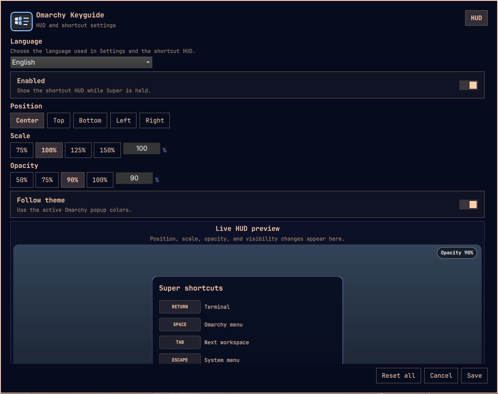

# Omarchy Keyguide

[English](README.md) · [한국어](README.ko.md) · [简体中文](README.zh-CN.md) · [日本語](README.ja.md) · [Español](README.es.md)

> 公开仓库：<https://github.com/mrai125kr/omarchy-keyguide>



Omarchy Keyguide 是一款面向 Omarchy 的插件。它用不干扰输入的 HUD 显示当前可用
快捷键，并允许用户在受控的安全范围内注册、修改和移除快捷键。

## 用途与适用人群

Keyguide 的主要目的，是让 Omarchy 新用户无需记住大量组合键，也能立即了解当前
按键组合可以执行什么操作。对于熟悉 Omarchy 的用户，它同样可以快速展示本机
实际生效的绑定，并搜索已安装的应用程序。

你可以使用 Keyguide：

- 按住某个 `Super` 修饰键组合，查看此刻可用的快捷键；
- 使用英语或当前界面语言搜索常规操作；
- 在同一个选择器中查找已安装的图形应用与命令；
- 在冲突检查保护下移动、替换、移除或恢复受支持的快捷键；
- 调整 HUD 的位置、缩放、透明度、主题跟随和可见条目。

Keyguide 不是宏录制器，也不是不受限制的 Hyprland 配置编辑器。它只允许修改能够
安全重建并验证结果的操作。

## 主要功能

- 设置 HUD 位置、缩放、透明度、主题跟随、可见组合和单独条目
- 设置界面与 HUD 支持英语（默认）、韩语、日语、简体中文和西班牙语
- 空闲按键在居中弹窗中注册，已有按键可在对应行附近修改或移除
- 在同一搜索框中查找常规操作、已安装应用和命令
- 应用程序显示桌面图标，命令使用 `(CMD)` 标记
- 常规操作同时支持英语和当前界面语言搜索
- 选择器打开时自动反映程序的安装与卸载
- 使用完整的 Hyprland 运行时绑定列表检查冲突，包括隐藏绑定
- 发生冲突、并发修改或重载错误时精确回滚
- “全部重置”可恢复被移动的原始快捷键并移除 Keyguide 新建的快捷键

## 系统要求与兼容性

目标环境为 Omarchy `4.0.0-1`、Hyprland `0.56.2` 或更高版本。除标准
Omarchy 环境外，还需要 Python 3、`xkbcli` 和可读取的键盘事件设备。首次通过
源码或 Git 插件安装时需要 C 编译器，可通过 Arch Linux 的 `base-devel` 提供。

在仓库根目录运行以下命令检查本机兼容性：

```sh
PYTHONPATH=src/backend python -m keyguide_backend compat
```

该命令以 JSON 输出检测到的版本、键盘事件设备可用性和具体错误。不受支持时会
返回非零退出码。

## 安装与使用

### 通过 Omarchy Git 插件安装 — 推荐

```sh
omarchy plugin add https://github.com/mrai125kr/omarchy-keyguide.git --enable
```

首次启用时，Keyguide 会从仓库内的 C 源码编译一个小型非抓取式输入观察器，
因此可能需要稍等片刻。它不会从外部下载可执行文件。顶部栏出现 Keyguide 图标
后，可点击图标打开快速控制或完整设置界面。

### 首次使用

1. 从顶部栏的 Keyguide 图标打开完整设置。
2. 选择界面语言。默认语言为英语，并提供韩语、日语、简体中文和西班牙语。
3. 设置 HUD 位置、缩放、透明度、主题跟随及需要显示的修饰键组合。
4. 按住 `Super`，或按住 `Super` 与 Ctrl、Shift、Alt 的任意组合，即可显示该
   组合当前可用的快捷键。
5. 在快捷键编辑中选择空闲按键，会在中央打开注册窗口。点击已有条目的“更改”，
   编辑窗口会在该行附近打开；点击“移除”会让该按键变为空闲状态。
6. “全部重置”会恢复可恢复的原始绑定，并移除 Keyguide 新增的快捷键，不会
   重置无关的 Omarchy 设置。

### 搜索和注册快捷键操作

一个搜索框可同时查找常规操作、已安装应用和可执行命令。常规操作可使用英语或
当前界面语言搜索。应用条目显示桌面图标，命令显示 `(CMD)`；只有选择命令时才会
显示可选参数输入框。

将已有操作注册到新按键时，Keyguide 会移动原绑定，而不是复制同一操作。替换
已占用按键前，会显示即将被移除的操作名称并要求再次确认。无法安全重建的操作会
保留为只读，并显示具体原因。

### 更新

```sh
omarchy plugin update mrai.keyguide --yes
```

Omarchy 会显示更新差异并执行快进更新。如果本地修改阻止快进，请先保存或检查
这些修改。

### 移除

```sh
omarchy plugin remove mrai.keyguide
```

移除 Git 插件时，仓库内生成的构建文件也会一并删除。默认情况下，Keyguide 的
显示偏好和独立管理的快捷键模块会保留，以便重新安装或升级时继续使用原选择。

### 从源码安装与卸载

```sh
make test
make install
```

如果需要在保留用户 Shell 设置的同时升级现有安装，请运行：

```sh
PRESERVE_USER_SHELL=1 make install
```

只移除经过安装清单验证的文件：

```sh
make uninstall
```

如果需要先重置 Keyguide 管理的快捷键和显示偏好，再完成卸载，请明确使用：

```sh
REMOVE_PREFERENCES=1 make uninstall
```

## 安全与隐私

- 输入观察器不会抓取、吞掉或重放按键，也不会记录键入内容。
- Keyguide 不会修改 `~/.config/hypr/bindings.lua`。
- 只有用户确认快捷键修改后，才会更新专用的生成模块。
- 保存前、Hyprland 重载后以及实际运行时都会检查冲突和结果一致性。
- 如果发生错误，会恢复修改前的精确文件字节，不留下部分配置。
- 不收集或存储密码、API 令牌、账号信息或网络数据。
- 卸载程序不会删除已验证安装清单之外的文件，也不会覆盖独立的用户修改。

快捷键修改保存在
`~/.local/state/omarchy/toggles/hypr/omarchy-keyguide.lua`，HUD 显示设置保存在
`~/.local/share/omarchy-keyguide/settings.json`。

## 故障排查

- 首先运行兼容性检查命令，查看明确的错误原因。
- 如果缺少编译器，请运行 `omarchy pkg add base-devel`，然后重新安装或更新。
- 如果 HUD 无法检测按键保持状态，请在兼容性结果中确认是否有可读取的键盘
  事件设备。
- 如果插件已安装但界面没有出现，请运行 `omarchy restart shell` 后重试。
- 使用 `omarchy plugin validate .` 验证下载源码的插件结构。
- 遇到重复按键、含糊操作、不受支持的按键或并发外部修改时，Keyguide 会拒绝
  保存并显示原因。

## 开发与验证

```sh
make test
make build
```

`make test` 运行非破坏性自动测试；`make build` 构建输入观察器并编译检查
Python 后端。

## 许可证

本项目采用 MIT 许可证。详情请参阅 [LICENSE](LICENSE) 和 [NOTICE](NOTICE)。
